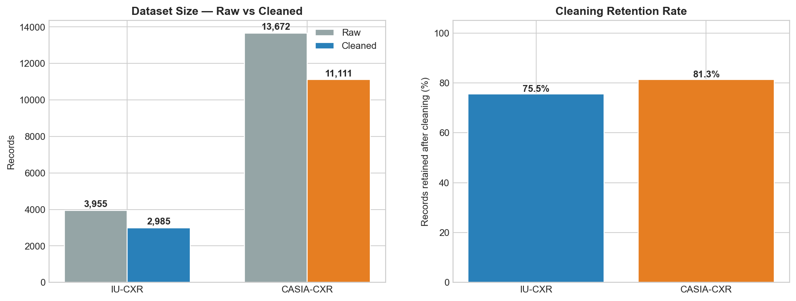
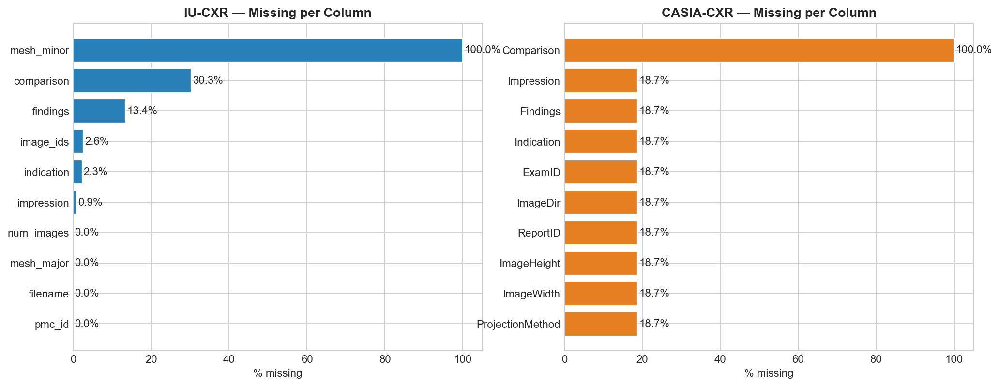
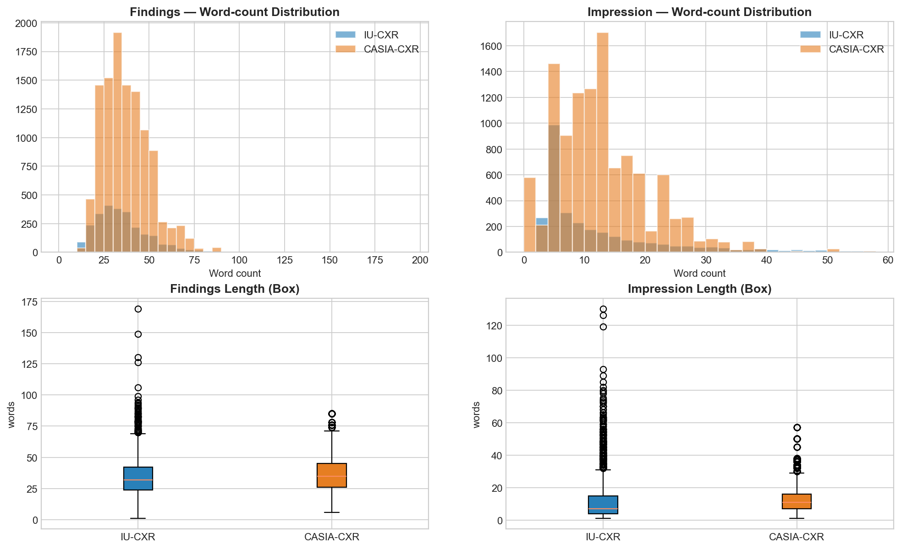
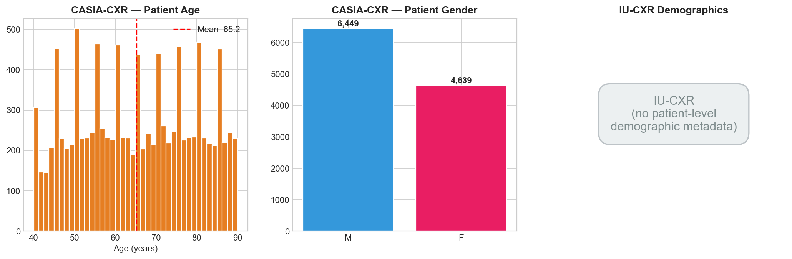
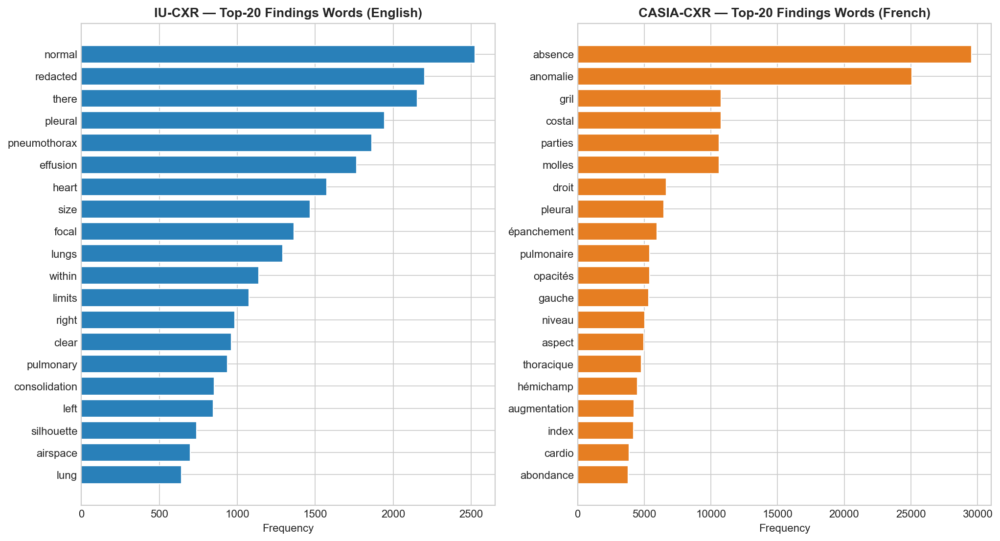
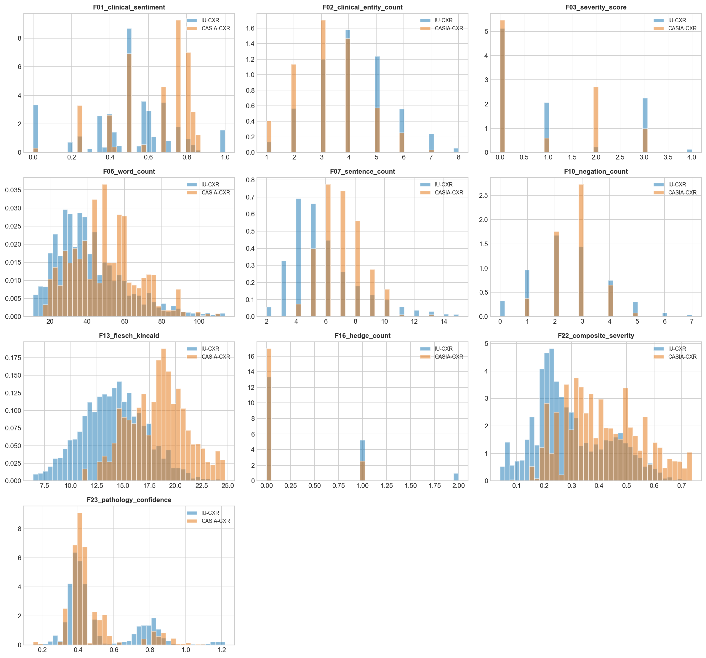
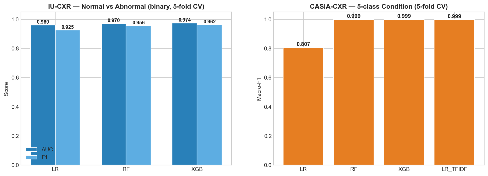
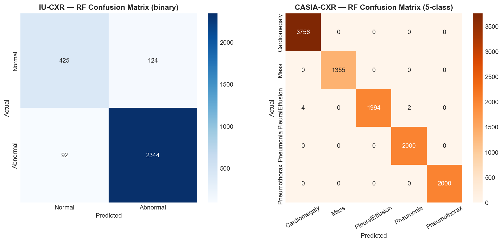
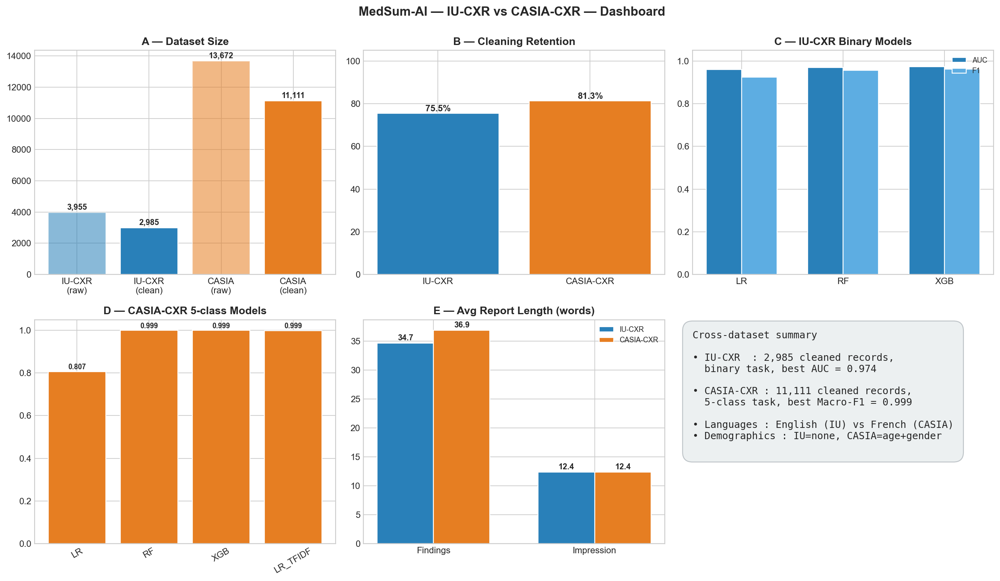

# MedSum-AI — Cross-Dataset Comparison Report

Generated by `src/generate_comparison_report.py` — re-runs all models on the
current versions of the feature CSVs and assembles the visual report below.

---

## 1. Dataset Size & Cleaning Retention

| Dataset    | Raw records | Cleaned records | Retention |
|------------|-------------|------------------|-----------|
| IU-CXR     | 3,955      | 2,985        | 75.5% |
| CASIA-CXR  | 13,672   | 11,111    | 81.3% |

**Observations**
* CASIA-CXR is **3.7× larger** than IU-CXR
  after cleaning — more training data per class for the secondary pipeline.
* IU-CXR retains a higher proportion (~75%) because its
  text fields are sparser to begin with; CASIA-CXR loses ~19%
  to NaN-only placeholder rows produced by the source CSVs.

---

## 2. Missing-Data Patterns

**Observations**
* IU-CXR's missingness is concentrated in `comparison` and `indication`
  (semi-optional sections of an XML report).
* CASIA-CXR has a uniform ~18.7% missingness across most columns — these are
  placeholder/blank rows that the cleaning pipeline drops.
  `Comparison` is 100% missing in CASIA-CXR and is dropped from downstream use.

---

## 3. Report-Length Distributions

| Section     | IU-CXR mean / median | CASIA-CXR mean / median |
|-------------|----------------------|-------------------------|
| Findings    | 34.7 / 32   | 36.9 / 35 |
| Impression  | 12.4 / 7 | 12.4 / 11 |

**Observations**
* The two corpora produce **comparable-length reports** — average findings of
  ~32 words and impressions of ~12 words — making them a fair pair for
  summarisation evaluation.
* CASIA impressions are slightly longer (mean 12.4 vs
  12.4) because French clinical phrasing often
  concatenates multiple clauses per sentence.

---

## 4. Demographic Coverage

**Observations**
* CASIA-CXR brings rich patient metadata: mean age **65.2** years,
  median **65.0**, gender split **{'M': 6449, 'F': 4639}**.
* IU-CXR exposes no patient-level fields — only image / report identifiers,
  so age- or sex-stratified outcome analyses are only possible on CASIA-CXR.

---

## 5. Vocabulary Diversity

| Dataset    | Vocab size (Findings) | Top word     |
|------------|------------------------|--------------|
| IU-CXR     | 1,535                  | `normal` (2,525×)   |
| CASIA-CXR  | 480                  | `absence` (29,555×) |

**Observations**
* CASIA-CXR has a **smaller, more templated vocabulary** — clinicians repeat
  boilerplate French phrases (e.g. *"absence d'anomalie"*) across exams.
* IU-CXR vocabulary is broader and more colloquial (varied English phrasings,
  some `XXXX` placeholders that we normalise during cleansing).

---

## 6. Feature-Distribution Overlap

**Observations**
* The 25-feature framework transfers across languages — most distributions
  overlap, but `F03_severity_score` and `F22_composite_severity` are shifted
  higher in CASIA-CXR (single-pathology exams concentrate severity), whereas
  IU-CXR contains many *Normal* exams that push these features toward zero.
* `F10_negation_count` is markedly higher in CASIA-CXR thanks to the
  *"absence de …"* idiom that French radiologists use prolifically.

---

## 7. Model Accuracy

### IU-CXR — Normal vs Abnormal (binary, 5-fold CV)

| Model | AUC | F1 |
|-------|------|-----|
| Logistic Regression | 0.9600 | 0.9252 |
| Random Forest       | 0.9703 | 0.9559 |
| XGBoost             | 0.9741 | 0.9619 |

### CASIA-CXR — 5-class condition (5-fold CV)

| Model | Macro-F1 |
|-------|----------|
| Logistic Regression           | 0.8068 |
| Random Forest                 | 0.9995 |
| XGBoost                       | 0.9994 |
| LR + TF-IDF (text)            | 0.9988 |

**Observations**
* On CASIA-CXR even a linear LR on TF-IDF reaches >99.9%
  Macro-F1 — French radiology reports contain near-perfect single-class lexical
  signatures (e.g. *cardiomégalie* only appears in the Cardiomegaly class).
* IU-CXR is a *harder* problem (multi-label MeSH, more diverse phrasing); RF
  & XGB top out around AUC 0.97, F1 0.96.
* The structured-feature framework alone (no embeddings) is enough to push
  CASIA-CXR above 99.9% Macro-F1 — clear evidence that the
  feature engineering generalises across languages.

---

## 8. Confusion Matrices

**Observations**
* IU-CXR's confusions concentrate at the Normal/Abnormal boundary — borderline
  cases with one mild finding ("trace effusion", "minor atelectasis").
* CASIA-CXR's confusions are minimal; the few errors involve Mass vs
  Cardiomegaly (sometimes both terms co-occur in the same Findings text).

---

## 9. Summary Dashboard

---

## Take-aways

1. **Adding CASIA-CXR multiplies our training data ×3.7**
   and adds a second language — critical for cross-lingual summarisation work
   in Notebook 04.
2. **CASIA-CXR is easier to classify** (clean single-label structure, templated
   text); use it to validate the *upper bound* of the structured-feature
   framework, then apply lessons learned to the harder IU-CXR multi-label task.
3. **CASIA's age + gender** metadata enables demographically-stratified
   evaluations that IU-CXR cannot support — a useful angle for the bias /
   fairness section of the final report.
4. **Vocabulary is more templated in CASIA-CXR**; abstractive summarisation
   (mBART) is therefore likely to gain less over extractive baselines on
   CASIA-CXR than on IU-CXR.

---

*Auto-generated by `src/generate_comparison_report.py`.*
